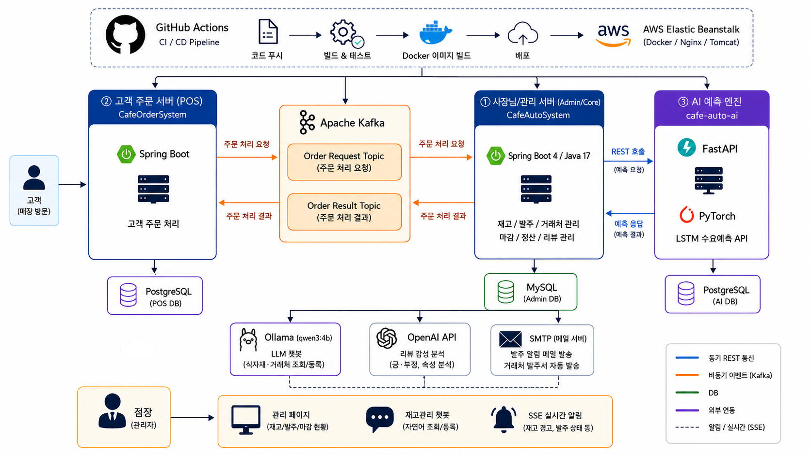

# 📦 OrderMatic (오더매틱)

### 👨‍🏫 프로젝트 소개

매장 마감 시 수기 재고 실사의 번거로움과 판매 데이터-원자재 소모량 간의 전산 불일치 문제를 해결하기 위한 플랫폼입니다. **PyTorch LSTM 기반의 AI 수요 예측 엔진**을 활용해 내일 필요한 자재 발주량을 정밀하게 제안하고, 점장의 단일 컨펌 링크 클릭 한 번으로 **거래처별 RPA 엑셀 명세서 자동 생성 및 이메일 분할 전송**까지 종결하는 End-to-End 카페 물류 자동화 시스템입니다.

---

### 💡 개발 목적

* **데이터 기반 재고 관리 및 비용 절감**: FIFO(선입선출) 엔진 및 AI 예측을 통해 과잉 발주로 인한 잉여 재고 폐기 리스크 최소화
* **RPA 기반 매장 운영 효율화**: 거래처별 발주서 작성 및 엑셀 수동 가공 공수를 자동화하여 일평균 1시간 이상의 행정 소요 단축
* **도메인 무결성 및 비즈니스 파이프라인 통합**: AI 시계열 예측 장부와 실제 물류 주문 원장 간의 데이터 단동 현상을 차단하고 정합성 100% 달성

---

### 🧑‍💻 팀원/역할

| 이름 | 역할                    | 담당 업무 |
| --- |-----------------------| --- |
| **심준현** | 팀장 (CI-CD/레시피)        | GitHub Actions + AWS Elastic Beanstalk CI/CD 파이프라인, JOIN FETCH 기반 레시피 자동 재고 차감 엔진 |
| **유환빈** | 팀원 (MSA/이벤트)          | 도메인별 서버 분리(사장/구매), Kafka + Outbox Pattern 비동기 이벤트 동기화, Open API 리뷰 감성 분석 |
| **이한승** | 팀원 (마감/챗봇)            | 월말 재고 장부 자동 마감 스케줄러, 네이티브 쿼리 기반 이월 로직, Ollama LLM 연동 2단계 폴백 재고관리 챗봇 |
| **장민서** | **팀원 (AI/RPA 파이프라인)** | PyTorch LSTM 기반 실시간 수요 예측 스케줄러 구축, Apache POI 기반 RPA 발주 명세서 일괄 가공 및 이메일 분할 전송 프로세스 전담, 데이터 단위 파편화 정제 및 정합성 무결성 확보 |

---

### 🛠️ 기술 스택

* **Front-end**: `React Native`, `React`, `Chart.js`, `HTML5/CSS3/JS`
* **Back-end**: `Java 17`, `Spring Boot`, `FastAPI (Python)`, `Gradle`
* **Database**: `MySQL`, `PostgreSQL`
* **Libraries**: `Spring Data JPA`, `MyBatis`, `Apache POI`, `JavaMailSender`, `Lombok`
* **Message Broker**: `Apache Kafka`
* **AI / ML**: `PyTorch (LSTM 모델)`, `Ollama`, `Open API`
* **Infra / DevOps**: `AWS Elastic Beanstalk`, `Docker`, `Nginx`, `Tomcat`, `GitHub Actions (CI/CD)`

---

### ⚙️ 주요 기능

#### 1. 레시피 기반 실시간 재고 자동 차감 (`Spring Boot` · `JPA` · `LOG SUM`)

* **데이터 기반 실시간 차감**: 고객 주문 수신 시 `menu_recipe` 기준으로 필요한 자재 소요량을 자동 계산.
* **재고 검증 및 경고**: `COALESCE(SUM(amount), 0)` 집계 연산으로 현재고를 실시간 검증하며, 부족 시 예외를 반환하고 안전재고 미달 시 시스템 경고 로그를 자동으로 기록.

#### 2. LSTM 수요 예측 기반 AI 발주 제안 (`PyTorch` · `Python`)

* **실시간 발주 연산**: 매일 지정된 마감 시간에 배포된 `FastAPI` 서버의 `PyTorch LSTM` 시계열 모델과 통신하여 내일 필요한 자재별 발주 제안량을 정밀 연산.
* **예측 데이터 영속화**: 연산된 데이터는 분석 로그 적재와 동시에 실제 발주 원장 테이블에 대기(`PENDING`) 상태 스냅샷으로 실시간 동기화.

#### 3. RPA 엑셀 자동 분할 및 이메일 승인 마감 (`Apache POI` · `JavaMail`)

* **거래처별(Vendor) 동적 그룹핑**: 대기(`PENDING`) 상태인 발주 데이터를 Java Stream API를 활용해 거래처별로 실시간 분류.
* **원스톱 자동화 파이프라인**: 점장이 컨펌 메일의 단일 링크를 클릭하는 것만으로 `[보안 비밀번호 검증 ➡️ Apache POI 엑셀 표준 서식 명세서 빌드 ➡️ JavaMailSender 거래처별 분할 발송 ➡️ 주문 완료(COMPLETED) 상태 마감 ➡️ 실시간 입고 장부 적재]` 프로세스를 무인화 종결.

#### 4. 이중화 구조의 재고 관리 챗봇 (`Ollama LLM` · `WebClient`)

* **자연어 이해 기반 제어**: `Ollama(qwen3:4b)` 모델을 연동하여 매장 내에서 자연어 대화만으로 식자재·거래처 등록 및 실시간 재고 조회·수정 가능.
* **2단계 폴백(Fallback) 예외 설계**: AI 서버 미연결 또는 장애 발생 시, 세션을 유지한 채 즉시 규칙 기반(Rule-based) 정형 챗봇 모드로 안전하게 전환되어 서비스 연속성 보장.

#### 5. AI 리뷰 감성 분석 및 자동 답글 생성 (`Open API`)

* **카테고리별 감정 구조화**: 리뷰 원문을 LLM에 전달하여 전체 긍부정 분석 및 맛·서비스·위생 등 속성별 감정을 JSON 데이터로 명확히 구조화.
* **매장 브랜딩 및 대응**: 분석된 결과를 바탕으로 사장님 페이지와 연동하여 리스크 수준에 따른 신속한 대응 및 자동 리뷰 답글 작성을 지원.

#### 6. GitHub Actions + AWS Elastic Beanstalk 기반 무중단 `CI/CD`

* **배포 자동화 인프라**: 특정 브랜치 push 발생 시 `GitHub Actions` 배포 액션이 자동 트리거되어 JDK 17 및 Gradle 기반 환경에서 안전하게 빌드 및 자동 배포 수행.
* **운영 환경 최적화**: `Procfile` JVM 메모리 파라미터(`-Xmx300m -Xms128m`) 튜닝을 적용하여 한정된 클라우드 자원 내에서 웹 서버 구동 효율성 및 안정성을 극대화.

---

### 📝 서비스 아키텍처

---

### 🔗 배포 및 시연 정보

* **📺 시스템 통합 시연 영상**: [OrderMatic YouTube 시연 영상](https://www.youtube.com/watch?v=PrIozx2ltO8)
* **🖥️ 사장님 전용 서버 (Admin)**: [AWS 배포 도메인](http://cafesystem-env.eba-sppmaf8d.ap-northeast-2.elasticbeanstalk.com/vendor-ingredient)
* **🛒 매장 고객 주문 서버 (POS)**: [AWS 배포 도메인](http://cafeordersystem.ap-northeast-2.elasticbeanstalk.com/pos)

---

### ✒️ 프로젝트 저장소(Repository) 링크

* **Core Backend & Admin Storage** ⚙️: [CafeAutoSystem GitHub](https://github.com/bbrrrvsg/CafeAutoSystem)
* **AI FastAPI Prediction Engine Storage** 🧠: [cafe-auto-ai GitHub](https://github.com/bbrrrvsg/cafe-auto-ai)
* **Customer POS/Order Storage** 💻: [CafeOrderSystem GitHub](https://github.com/haarooo/CafeOrderSystem)

